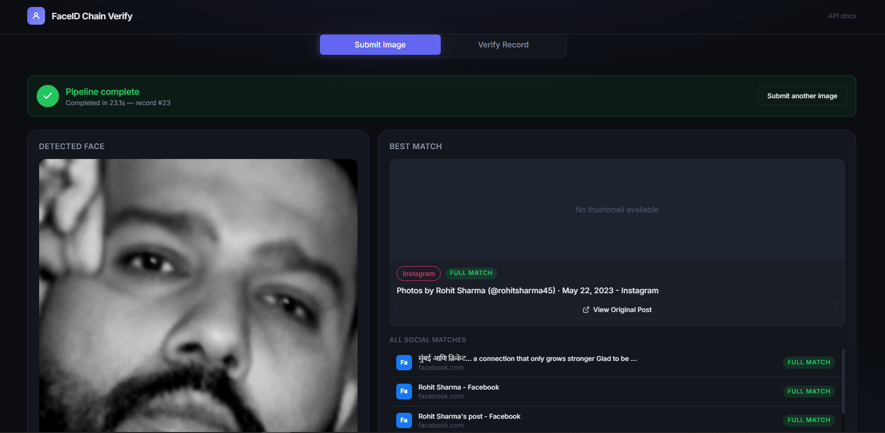
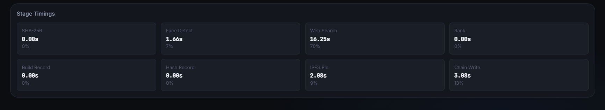

# faceid-chain-verify

**Detect a face in an image, search for it on the public web, pin the match record to IPFS, and anchor a tamper-evident proof on Polygon Amoy.**

The pipeline takes an image, extracts a 512-dimensional face embedding using InsightFace, searches the web via Google Cloud Vision's Web Detection API, filters results to social-media domains, builds a canonical JSON record, pins it to IPFS via Pinata, and writes a SHA-256 hash of that record onto a Polygon Amoy smart contract. The result is a publicly verifiable proof that a particular face image was linked to a particular URL at a particular moment — a tamper-evident anchor anyone can independently audit.

The focus is on **tamper-evidence**, not on-chain enforcement. The record hash stored on-chain is deterministic: anyone who has the same record JSON can recompute the hash and verify it matches what the contract stores. This makes the chain useful as a public, append-only notary for evidence, not as a system that controls value or permissions.

---

## Table of contents

1. [What it does](#1-what-it-does)
2. [Evidence — real run walkthrough](#2-evidence--real-run-walkthrough)
3. [Architecture](#3-architecture)
4. [Tech stack](#4-tech-stack)
5. [Setup](#5-setup)
6. [How to run](#6-how-to-run)
7. [Blockchain: Polygon Amoy](#7-blockchain-why-polygon-amoy)
8. [Known limitations](#8-known-limitations)
9. [Responsible use](#9-responsible-use)
10. [License](#10-license)

---

## 1. What it does

`faceid-chain-verify` runs a 7-stage pipeline on a single image file. First it detects any faces and extracts a 512-dimensional embedding (InsightFace `buffalo_l`). It then sends the image to Google Cloud Vision's Web Detection API, which returns pages across the web that contain visually similar images — ranked by exact match, partial match, and visual similarity. Results are filtered to a fixed list of social-media domains (`x.com`, `twitter.com`, `instagram.com`, `facebook.com`, `linkedin.com`, `reddit.com`, `pinterest.com`, `tumblr.com`) so the pipeline stays focused on publicly posted social content. A canonical JSON record is built from the input image's SHA-256, the face embedding hash, and the top-ranked match metadata.

The record is then pinned to IPFS via Pinata, which returns a content-addressed CID. The canonical JSON bytes are hashed with SHA-256, and the resulting hash — along with the CID — is written in a single transaction to the `RecordRegistry` contract on Polygon Amoy. The transaction hash and assigned record ID form the public anchor.

Verification works in reverse: given a record ID, the contract returns the stored hash and CID; the verifier recomputes the SHA-256 of the record JSON and confirms it matches. No trust in the original submitter is required — the hash is deterministic and self-authenticating.

---

## 2. Evidence — real run walkthrough

The screenshots below are from an actual run of the deployed pipeline (record #23), not staged or mocked data.

### Real social match found, no hardcoded results



The pipeline was given a photo and, via Google Cloud Vision's Web Detection API, found the same face across multiple real public posts on Instagram and Facebook — including exact ("full match") hits with distinct captions and post URLs. Each result links directly to the real originating post via **View Original Post**.

Note the **"No thumbnail available"** message on the top match: this is intentional, not a bug. Facebook and Instagram block direct hotlinking of images from external servers, so while Google's index confirms the image exists at that URL (and the pipeline can link to it), the pipeline cannot always re-display the raw thumbnail. Rather than showing a broken image icon, the UI shows this fallback message with the real link still functional — see [Known limitations](#8-known-limitations).

### Real pipeline timing, stage by stage



This is a genuine per-stage timing breakdown from a live run: face detection (1.66s), the web search call to Google Vision (16.25s — the dominant cost, since it's a real network round-trip to Google's API, not a local computation), IPFS pinning (2.08s), and the on-chain write (3.08s). These numbers vary run to run because they reflect real network latency to three independent external services, not simulated delays.

---

## 3. Architecture

```
┌──────────────┐     ┌────────────────────────────────────┐
│  Input Image │────▶│  Stage 1 — Face Detection         │
│  (JPEG/PNG)  │     │  + 512-d Embedding               │
│              │     │  InsightFace buffalo_l            │
└──────────────┘     └─────────────────┬──────────────────┘
                                       │
                                       ▼
                          ┌────────────────────────────────────┐
                          │  Stage 2 — Reverse Image Search   │
                          │  Google Cloud Vision               │
                          │  Web Detection API                │
                          └─────────────────┬──────────────────┘
                                            │
                                            ▼
                          ┌────────────────────────────────────┐
                          │  Stage 3 — Domain Filter          │
                          │  Social media domains only        │
                          │  (x.com, instagram, reddit…)     │
                          └─────────────────┬──────────────────┘
                                            │
                                            ▼
                          ┌────────────────────────────────────┐
                          │  Stage 4 — Canonical Record JSON  │
                          │  SHA-256, embedding hash, match   │
                          │  metadata, timestamps             │
                          └─────────────────┬──────────────────┘
                                            │
                                            ▼
                          ┌────────────────────────────────────┐
                          │  Stage 5 — IPFS Pin              │
                          │  Pinata REST API → CID           │
                          └─────────────────┬──────────────────┘
                                            │
                                            ▼
                          ┌────────────────────────────────────┐
                          │  Stage 6 — Record Hash            │
                          │  sha256(canonical_json_bytes)     │
                          └─────────────────┬──────────────────┘
                                            │
                                            ▼
                          ┌────────────────────────────────────┐
                          │  Stage 7 — On-chain Anchor        │
                          │  Polygon Amoy / RecordRegistry    │
                          │  recordHash + CID + timestamp     │
                          └─────────────────┬──────────────────┘
                                            │
                                            ▼
                          ┌────────────────────────────────────┐
                          │  Verification (read-only)          │
                          │  Re-hash record JSON, compare    │
                          │  against on-chain value           │
                          └────────────────────────────────────┘
```

### Directory structure

```
faceid-chain-verify/
├── backend/
│   ├── app/
│   │   ├── face/           # InsightFace wrapper, embedding + hash
│   │   ├── search/         # Google Cloud Vision client, domain filter
│   │   ├── chain/          # Pinata IPFS client, Amoy contract client
│   │   ├── pipeline/       # Orchestration (run_pipeline, verify)
│   │   ├── utils/          # Retry with exponential backoff
│   │   └── api/            # FastAPI endpoints
│   └── tests/              # pytest suite (unit + integration)
├── contracts/
│   └── RecordRegistry.sol   # Smart contract source
├── frontend/                # Web UI
├── docs/
│   └── evidence/            # Screenshots proving real pipeline runs
├── .env.example             # Environment variable template
├── requirements.txt         # Pinned Python dependencies
└── requirements_lock.json   # Strict version lock for reproducibility
```

---

## 4. Tech stack

| Layer | Technology | Why this choice |
|---|---|---|
| **Face detection** | InsightFace (`buffalo_l`) | State-of-the-art open-source face analysis; 512-d embedding captures facial geometry; ONNX runtime means no GPU required for inference |
| **Reverse image search** | Google Cloud Vision Web Detection | REST-based, scalable, no infrastructure to manage; `pagesWithMatchingImages` gives page-level matches directly |
| **IPFS pinning** | Pinata | Developer-friendly REST API with SDK support; handles pinning infrastructure so the CID stays reachable |
| **Smart contract** | Polygon Amoy + Solidity | Amoy is an EVM-compatible PoS testnet; near-instant finality (~2s), near-zero gas fees; ideal for a demonstrator that anchors hashes |
| **Contract ABI / RPC** | `web3.py` + `eth-account` | Standard Python Ethereum stack; `eth-account` handles transaction signing without exposing private keys to RPC nodes |
| **Pipeline orchestration** | Python (plain) | No heavy framework needed; explicit stage tracking, typed Pydantic models, structured logging throughout |
| **API server** | FastAPI + Uvicorn | Async, auto-generates OpenAPI docs, native Pydantic validation for request/response schemas |
| **Input validation** | PIL (`Pillow`) | `Image.open().verify()` detects corrupt/non-image uploads before they reach expensive API calls |
| **Retry logic** | Custom decorator | Exponential backoff with jitter for transient HTTP/connection errors; explicit billing/auth errors fail fast without wasting retries |
| **Testing** | pytest | Standard Python test runner; module-level skip on missing credentials keeps the test suite usable in CI without real API keys |

---

## 5. Setup

### 5.1 Prerequisites

- Python 3.11+
- A Polygon Amoy wallet with MATIC (use the faucet below)
- Google Cloud account
- Pinata account

---

### 5.2 Google Cloud Vision API key

1. Go to [console.cloud.google.com](https://console.cloud.google.com) and create or select a project.
2. Enable the **Cloud Vision API** for the project.
3. Go to **APIs & Services → Credentials → Create Credentials → API Key**.
4. Copy the key — you will paste it into `.env` as `GOOGLE_VISION_API_KEY`.
5. **Important:** billing must be enabled on the project for the Vision API to work (Google's free tier covers 1,000 requests/month).

---

### 5.3 Pinata IPFS

1. Sign up at [pinata.cloud](https://pinata.cloud).
2. Go to **API Keys → New Key**.
3. Create a key with **both** the `pinJSONToIPFS` and `pinFileToIPFS` scopes. `pinFileToIPFS` is required — the pipeline pins raw canonical bytes directly to guarantee the pinned content matches the on-chain hash byte-for-byte (see the byte-mismatch note in [Known limitations](#8-known-limitations)).
4. Copy both the **API Key** and **Secret API Key** — paste them into `.env`.

---

### 5.4 Polygon Amoy wallet + MATIC faucet

1. Install MetaMask or any EVM-compatible wallet.
2. Switch to the **Polygon Amoy** test network. RPC URL: `https://rpc-amoy.polygon.technology`. Chain ID: `80002`. Currency symbol: `MATIC`.
3. Get Amoy MATIC from a faucet, e.g. [faucet.polygon.technology](https://faucet.polygon.technology) or [alchemy.com/faucets/polygon-amoy](https://www.alchemy.com/faucets/polygon-amoy) — paste your Amoy wallet address, request test tokens.
4. Export your wallet's **private key** (MetaMask: Account Details → Show Private Key — this is different from your wallet address). Paste it into `.env` as `DEPLOYER_PRIVATE_KEY` — **without the `0x` prefix**.
5. Use a throwaway wallet dedicated to this project. Never reuse a wallet holding real funds, and never commit `.env` to source control.

---

### 5.5 Deploy the smart contract

```bash
# 1. Navigate to contracts/
cd contracts

# 2. Install dependencies
npm install

# 3. Compile (requires Hardhat)
npx hardhat compile

# 4. Deploy to Amoy (edit hardhat.config.js first to set your wallet)
npx hardhat run scripts/deploy.js --network polygonAmoy
# → output: "Contract deployed to: 0x..."

# 5. Copy the deployed address and paste it into .env as CONTRACT_ADDRESS
```

The `RecordRegistry` contract source is in `contracts/contracts/RecordRegistry.sol`. It stores `{recordHash, ipfsCID, timestamp, submitter}` and exposes `submitRecord`, `getRecord`, `verifyRecord`, and `recordCount`.

---

### 5.6 Environment setup

```bash
# Copy the template
cp .env.example .env

# Open .env and fill in all values:
#   GOOGLE_VISION_API_KEY=AIza...
#   PINATA_API_KEY=...
#   PINATA_SECRET_API_KEY=...
#   POLYGON_AMOY_RPC_URL=https://rpc-amoy.polygon.technology
#   DEPLOYER_PRIVATE_KEY=<your-64-char-hex-key-without-0x>
#   CONTRACT_ADDRESS=0x...
```

`.env` is listed in `.gitignore` and must never be committed. Only `.env.example` (with placeholder values) belongs in version control.

---

### 5.7 Install Python dependencies

```bash
pip install -r requirements.txt
```

For strict reproducibility (e.g. in a CI/judge environment), verify against the lock file:

```bash
# Check installed versions match pinned versions
pip check
pytest backend/tests -v
```

---

## 6. How to run

### 6.1 Backend API

```bash
# Start the FastAPI server
uvicorn backend.app.api.main:app --reload --port 8000
```

The API is now available at `http://localhost:8000`. Open `http://localhost:8000/docs` for the interactive Swagger UI.

**Endpoints:**

| Method | Path | Description |
|---|---|---|
| `POST` | `/api/pipeline/run` | Upload an image, returns a `job_id` immediately |
| `GET` | `/api/pipeline/status/{job_id}` | Poll for job status and result |
| `GET` | `/api/pipeline/verify/{record_id}` | Verify an on-chain record |
| `GET` | `/api/image-proxy?url=...` | Proxy an image URL (bypasses CORS/hotlink blocks) |

**Upload an image:**

```bash
curl -X POST http://localhost:8000/api/pipeline/run \
  -F "image=@my_photo.jpg"
# → {"job_id": "a1b2c3d4e5f6", "status": "pending", ...}
```

**Poll for result:**

```bash
curl http://localhost:8000/api/pipeline/status/a1b2c3d4e5f6
# → {"status": "done", "stage": "complete", "progress": 1.0,
#     "result": {"record_id": 23, "tx_hash": "0x...", ...}}
```

**Verify a record:**

```bash
curl "http://localhost:8000/api/pipeline/verify/23"
# → {"record_id": 23, "on_chain": true, "all_passed": true,
#     "checks": [{"name": "...", "passed": true, ...}]}
```

---

### 6.2 Web UI

```bash
cd frontend
python -m http.server 3001
```

Open `http://localhost:3001`. Drag and drop an image onto the upload zone, watch the live stage tracker, and review the best match plus the full ranked list of social matches. Use the **Verify Record** tab to re-check any past record ID and see the three-way tamper-evidence check (on-chain existence, chain-vs-IPFS hash integrity, and optional face-embedding match against a re-uploaded photo).

---

### 6.3 CLI

```bash
# Run the pipeline directly on a file
python -m backend.app.cli run backend/tests/fixtures/mona_lisa.jpg

# Verify an existing record
python -m backend.app.cli verify 23

# Run in mock mode (skips all external calls — for CI only)
PIPELINE_MOCK_MODE=true python -m backend.app.cli run test.jpg
```

---

### 6.4 Running tests

```bash
# Unit + integration tests (skips live API tests when credentials are missing)
pytest backend/tests -v

# Run only the API tests (fast, no external dependencies)
pytest backend/tests/test_api.py -v

# Run with mock mode for a full pipeline pass without real credentials
PIPELINE_MOCK_MODE=true pytest backend/tests/test_pipeline_e2e.py -v -s
```

> ⚠️ **Mock mode warning:** When `PIPELINE_MOCK_MODE=true`, a loud banner is printed to stderr. Never enable it in production or with real credentials — it returns fake data and never calls any external service.

---

## 7. Blockchain: why Polygon Amoy

**Polygon Amoy** is a Polygon Labs EVM-compatible proof-of-stake testnet. It was chosen for three reasons:

1. **Near-zero gas cost.** A `submitRecord` call costs a small fraction of a testnet MATIC. This means hundreds or thousands of records can be anchored for negligible cost. There is no financial barrier to running the pipeline.

2. **Fast finality (~2 seconds).** The chain reaches finality in a few seconds, so a record is verifiable immediately after submission without waiting for multiple block confirmations.

3. **Full EVM compatibility.** The contract is written in Solidity and deployed to an EVM chain, so it works with any Ethereum tooling (`web3.py`, MetaMask, block explorers, Hardhat). Switching to Polygon Mainnet, Sepolia, or any EVM L2 would require only changing the RPC URL and redeploying.

### ⚠️ This is a testnet, not mainnet

Amoy is a **test network** — it has no monetary value, and its records are **not permanent in the same sense as mainnet**.

What testnet means in practice:
- The chain and all its records can be reset or shut down at any time by Polygon Labs.
- There is no economic security: a testnet validator has no incentive to maintain the chain indefinitely.
- Records on testnet cannot be used as legal evidence in most jurisdictions — they exist purely to demonstrate the technical pipeline.

**For a production tamper-evidence system**, deploy the `RecordRegistry` contract to a persistent EVM mainnet (Polygon PoS, Ethereum mainnet, etc.) where the chain has economic finality measured in years, not days.

The **tamper-evidence model** here is: *the on-chain hash is deterministic, so any holder of the canonical record JSON can independently verify it matches the stored anchor.* This works identically on testnet and mainnet — the difference is only how long the anchor persists.

---

## 8. Known limitations

**Be honest about what this system can and cannot do:**

- **Match quality depends on Google Vision's index.** Google Cloud Vision Web Detection is a general-purpose image search tool, not a face-search engine. It returns results based on what Google's crawler has indexed — meaning it only finds images that are already publicly accessible on the web. Images behind login walls, private accounts, or rare content that hasn't been crawled may not appear. Match quality also degrades for heavily cropped faces, unusual angles, low resolution, or heavy editing/artistic distortion.

- **Match coverage varies significantly by platform.** Reddit, Pinterest, Tumblr, and X/Twitter tend to be well-indexed by Google's crawler, so matches on these platforms are relatively reliable. Instagram and Facebook aggressively restrict crawler access and require login to view most content, so Google's index of them is sparse — real matches from these two platforms are rarer even when the content genuinely exists there.

- **Thumbnails for some matched images cannot always be displayed.** Facebook and Instagram block direct hotlinking of their hosted images from external servers, even when the underlying post is public and correctly identified by Google's index. When this happens, the UI shows "No thumbnail available" with the real post link still functional, rather than a broken image icon — see the record #23 screenshot in [Evidence](#2-evidence--real-run-walkthrough). The match itself is still valid and verifiable; only the visual thumbnail preview is affected.

- **Social domain filter is hardcoded.** The list of domains (`x.com`, `instagram.com`, etc.) is fixed in `backend/app/search/reverse_image_search.py`. There is no configuration file or environment variable to extend it. Adding domains requires a code change.

- **Single-face pipeline.** If an image contains multiple faces, the pipeline currently selects the largest/primary face. Multi-face handling is on the roadmap but not implemented.

- **Testnet records are impermanent.** As described in Section 7, records on Amoy have no guaranteed long-term persistence. A production deployment needs a mainnet chain.

- **Face recognition accuracy is image-dependent.** InsightFace's `buffalo_l` model performs well on well-lit, frontal images. It degrades on profile views, occluded faces, extreme expressions, or very low-resolution inputs. The `detection_confidence` score in the output lets callers decide whether to trust a result.

- **IPFS content persistence.** Pinata keeps content pinned as long as your account is active. If the Pinata account is deleted or the key is revoked, the CID may become unreachable from Pinata's gateway. Consider replicating pinning to a second provider for evidence-grade persistence.

- **Early records (IDs 1–9) have a broken chain↔IPFS integrity check.** These records were anchored during development before a byte-encoding mismatch was discovered. The pipeline was using Pinata's `pinJSONToIPFS` API, which serialises the JSON on Pinata's server — producing different bytes than Python's JSON encoder (e.g. one side encodes `0.0` as `0`). The on-chain hash was computed over Python-encoded bytes, but Pinata stored differently-encoded bytes, so the SHA-256 values diverge. Records 1–9 will fail the `chain_vs_ipfs_integrity` check during verification. This was fixed by switching the pipeline to pin raw canonical bytes via `pinFileToIPFS` instead of `pinJSONToIPFS`, and to hash those exact same bytes immediately before upload — ensuring the pinned content and the on-chain hash are always computed from an identical byte sequence, with no re-serialization step in between. All records anchored after this fix (ID 10 onward, including the demonstrated record #23) pass the integrity check correctly. The broken early records remain on-chain deliberately, as a live, honest example of the bug and its detection.

- **No authentication on the API.** The FastAPI server currently has no auth — anyone who can reach the port can submit images and read records. A production deployment needs JWT/session auth and rate limiting.

- **No user consent flow.** The pipeline does not check or record whether the person in the submitted image consented to being searched. This is a significant ethical and legal gap — see Section 9.

---

## 9. Responsible use

**This project is a technical demonstrator.** It is designed to show how a face detection → web search → IPFS → blockchain pipeline can create tamper-evident evidence records. Any production use involves serious ethical and legal considerations.

**Privacy implications of face search:**

- Searching for a person's face on the web and linking it to their image is a significant privacy act. In many jurisdictions (GDPR EU, CCPA California, BIPA Illinois, etc.), processing biometric data including face embeddings may require explicit informed consent.
- Publishing records that link a person's face to their social media accounts without consent could expose individuals to harassment, doxxing, or doxxing-adjacent harms.
- The pipeline has no mechanism to check for consent, process opt-out requests, or handle takedown notices.

**Before any production use, at minimum:**
1. Implement a consent flow that records who submitted the image and that the subject consented (or that the submitter has the legal right to submit).
2. Add an opt-out / takedown mechanism to remove records associated with a specific identity.
3. Consult a privacy lawyer for the jurisdictions where you operate.
4. Consider whether face search is actually necessary for your use case — hash-only anchoring (without face embedding) may be sufficient for many tamper-evidence scenarios.

This project includes these warnings in the documentation rather than silently glossing over them, because glossing over them would be irresponsible.

---

## 10. License

MIT License

Copyright (c) 2026

Permission is hereby granted, free of charge, to any person obtaining a copy
of this software and associated documentation files (the "Software"), to deal
in the Software without restriction, including without limitation the rights
to use, copy, modify, merge, publish, distribute, sublicense, and/or sell
copies of the Software, and to permit persons to whom the Software is
furnished to do so, subject to the following conditions:

The above copyright notice and this permission notice shall be included in all
copies or substantial portions of the Software.

THE SOFTWARE IS PROVIDED "AS IS", WITHOUT WARRANTY OF ANY KIND, EXPRESS OR
IMPLIED, INCLUDING BUT NOT LIMITED TO THE WARRANTIES OF MERCHANTABILITY,
FITNESS FOR A PARTICULAR PURPOSE AND NONINFRINGEMENT. IN NO EVENT SHALL THE
AUTHORS OR COPYRIGHT HOLDERS BE LIABLE FOR ANY CLAIM, DAMAGES OR OTHER
LIABILITY, WHETHER IN AN ACTION OF CONTRACT, TORT OR OTHERWISE, ARISING FROM,
OUT OF OR IN CONNECTION WITH THE SOFTWARE OR THE USE OR OTHER DEALINGS IN THE
SOFTWARE.